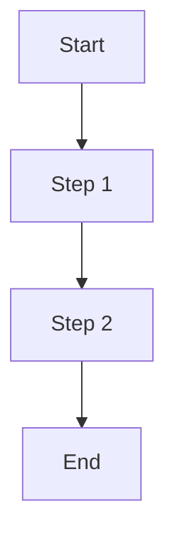

# Reference Guide

Detailed technical documentation for this skill.

## API Reference

### Function 1

```python
def function_name(param1: str, param2: int = 0) -> Result:
    """
    Brief description.

    Args:
        param1: Description of parameter 1
        param2: Description of parameter 2 (default: 0)

    Returns:
        Description of return value

    Raises:
        ValueError: When param1 is invalid
    """
```

### Function 2

```python
def another_function(data: dict) -> None:
    """
    Brief description.

    Args:
        data: Description of data parameter
    """
```

## Data Structures

### Structure 1

```python
@dataclass
class ExampleStructure:
    field1: str  # Description
    field2: int  # Description
    field3: Optional[str] = None  # Description
```

## File Formats

### Input Format

Description of expected input format:

```
field1,field2,field3
value1,value2,value3
```

### Output Format

Description of output format:

```json
{
  "result": "value",
  "metadata": {}
}
```

## Workflows

### Workflow 1: [Name]



1. **Step 1**: Description
2. **Step 2**: Description
3. **Step 3**: Description

## Dependencies

| Package | Version | Purpose |
|---------|---------|---------|
| package-name | >=1.0.0 | Description |

## Changelog

### [1.0.0] - YYYY-MM-DD
- Initial release
- Feature 1
- Feature 2
